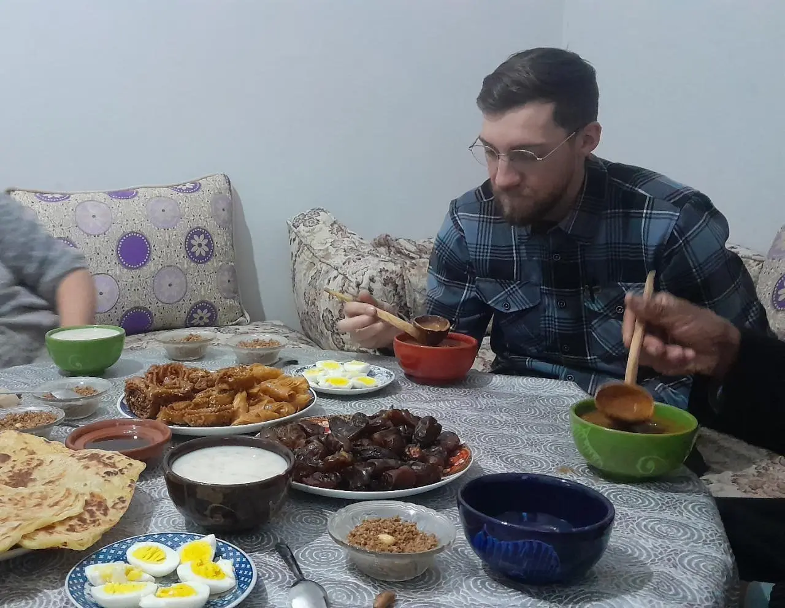
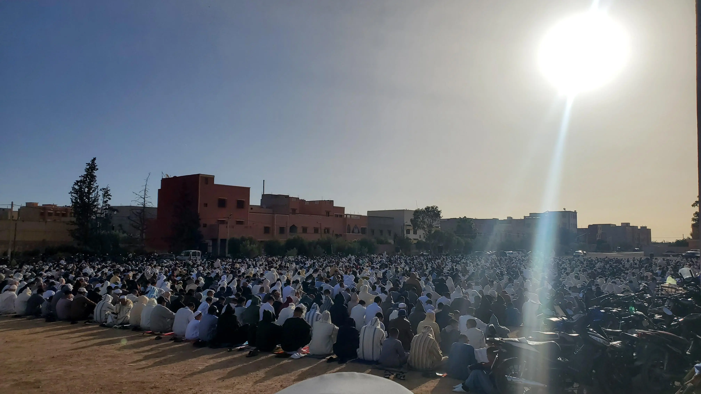
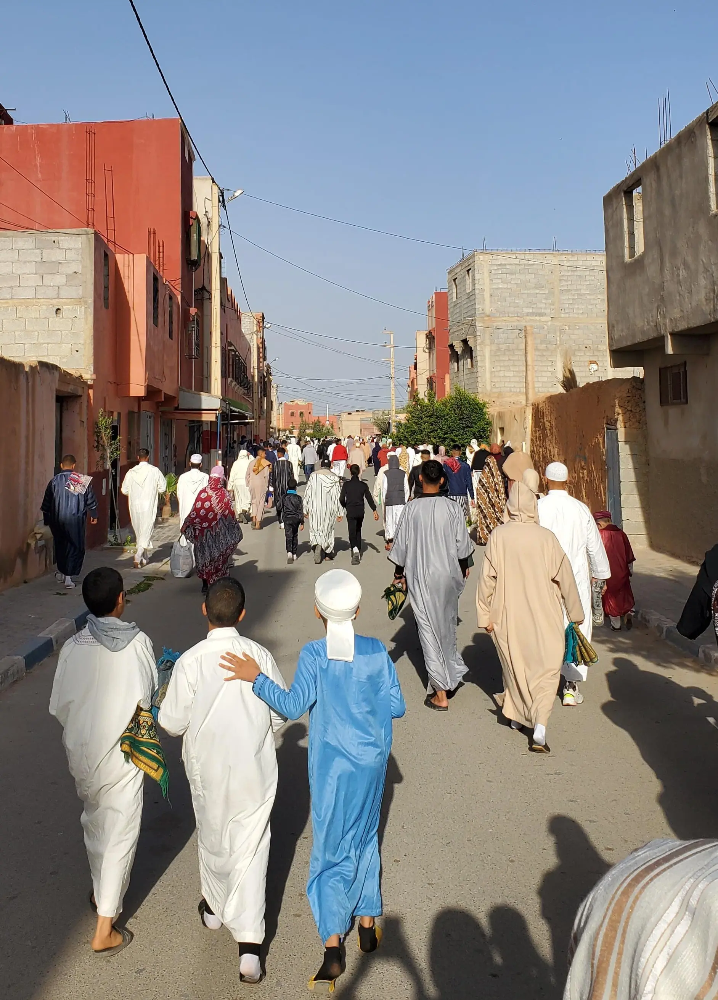
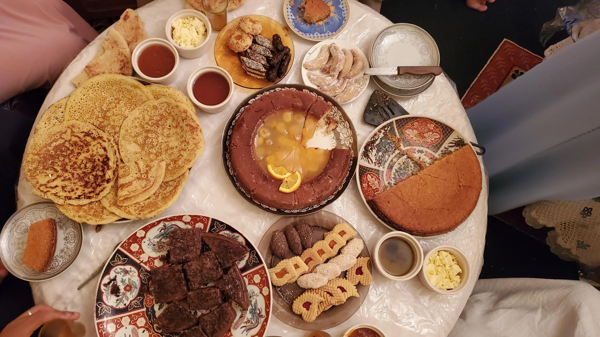

I experienced my second and final Ramadan (رمضان) in Morocco. Ramadan is such an important cultural event here and across all countries with a Muslim population. It is a special time that brings people together all across the Islamic world.

It's difficult to put all the feelings, experiences, and essence of Ramadan into one piece of writing, especially as an outsider that is still learning about it. To try and get close, I sat down with my host sister and counterpart, Hajar, and asked her questions about her story and relationship with the holy month. That interview, along with my own experiences and American viewpoint, informed what follows.

I feel quite proud learning culture and writing stories like this. I am honored to have the duty to untangle preconceptions and stereotypes that Americans have when thinking about Arab and Islamic culture. This is where the real power of human-to-human connection lies.

---

For Hajar, Ramadan is an exciting and thankful time. Even before Ramadan begins, she is filled with a sense of gratefulness that Allah gives her a chance every single year to live Ramadan again. It's a shared feeling across the community. In the weeks leading up, people are more positive and you see a lot more smiles. There is a sense that people have more energy during the day. As you walk down the streets and alleyways, there is a smell of _shabakiya[^1]_ in the air. Everyone is stocking up on the essential treat that is at every breakfast table in Morocco.

The thing that most Americans associate with Ramadan is fasting. It's the most visible part of the tradition and a large departure from our own culture. Fasting during Ramadan is one of the [five pillars of Islam](https://en.wikipedia.org/wiki/Five_Pillars_of_Islam) and is written directly in the Quran:

> O believers! Fasting is prescribed for you—as it was for those before you—so perhaps you will become mindful of Allah. (2.183)

Fasting, in an Islamic context, means abstaining from eating, drinking, having sex, chewing gum, and smoking while the sun is up. No, not even water. Not everyone is required to fast, however. Children, elderly, pregnant women, breastfeeding mothers, menstruating women, sick people, or people travelling are all exempt. Basically, if fasting harms someone's wellbeing, they are not required to fast. They should, however, make up those missed days of fasting later.

> Ramadan is the month in which the Quran was revealed as a guide for humanity with clear proofs of guidance and the decisive authority. So whoever is present this month, let them fast. But whoever is ill or on a journey, then let them fast an equal number of days after Ramadan. Allah intends ease for you, not hardship, so that you may complete the prescribed period and proclaim the greatness of Allah for guiding you, and perhaps you will be grateful. (2.185)

To start the day, there are people that dutifully wake up and walk down each street with drums, jostling everyone up about an hour before the _fajr_ call to prayer (around 5:45 am by the end of the month). This gives everyone a chance to have _suhoor_ which is the last meal before starting the fast.

Luckily for me, they didn't come around my neighborhood (that, or I'm a _really_ heavy sleeper)[^2]. This left me free to wake up if and when I wanted. For the first few days, I would get up and eat a light meal with yogurt, fruits, and maybe some eggs. I'd also chug a big bottle of water because I knew I wouldn't have any for the next 14 hours. As my sleep schedule got more and more bent out of shape as Ramadan went on, I started staying up later and later. In that case, I would just eat before going to bed at around two or three in the morning.

Once fasting begins, people go about their normal lives, doing as they normally would. Fasting gives Hajar energy. She, of course, feels thirsty, hungry, and tired throughout the day but she doesn't mind it one bit. For her, the time flies during the day. She is excited to go home and do even more work. Hajar recently had a baby, a sweet and easy-going little girl. After spending the day at her office, Hajar comes home to help prepare "breakfast" with her family and take care of her daughter. It's not work for her.

I can say with utmost certainty that I did not have the same experience.

The days were a slog. I'd try and get work done on my computer with no coffee or food to fuel my brain and nothing would get done (hence writing this months after Ramadan ending). Then, I'd go try and be social and present while breaking the fast with my host family. I tried my best but I couldn't help being irritable most days. A volunteer friend said it best:

> My sleep schedule is completely destroyed and I’m tired all the time which makes me irritable.  
> _Adam Kerkman_

Each afternoon, I would walk across town to my host family's home to break the fast with them. As I walked, I'd see families congregated outside, parents watching their children play soccer or older men talking amongst themselves, waiting for the sun to disappear. When I arrived, the women would usually be working in the kitchen getting everything ready to eat. My host dad would have the news on, watching it curiously with Hajar's daughter by his side. Piece by piece, the breakfast spread would get assembled; two tables were required to contain the sandwiches, _msmen_, _srraq zit_[^3], juice, and dates. It sounds like a lot of work but I know my other host sister, Souad, truly enjoys providing for and caring for her family.

In the last few minutes before the _maghrib_ call to prayer marked the end of that day's fast, we all wait in anticipation, wondering if we had actually missed the voice from the megaphone that echoes down every street. Once the time finally comes, everyone grabs a plump date from the small hill on the table and whispers to themselves a recitation, telling Allah that they have fasted for his sake and thanking him for the food. My host mother grabs the big aluminum ladle from the pot of _harira_ and starts filling up bowls. She can usually intuit what kind everyone wants (red or white) but still asks to make sure before passing them around. My signature move was to have two bowls of _harira_ before moving onto the rest of the feast.

While I love my host family and always feel welcome, I rarely felt like I truly belonged there during Ramadan. It felt like sitting down for a Thanksgiving meal with someone else's family. The air had an energy in it that made everyday feel like a holiday that I couldn't really participate in, like the feeling of not having any presents under the tree with my name on them.

Fasting is more complex than simply not consuming during the day, though. It's a commitment. It is an opportunity to physically feel what millions of people who live with food insecurity feel every day. It is a reminder to stop and appreciate what you have in your life. Fasting, counterintuitively, _adds_ more to your life in the form of empathy, gratitude, and connection to something bigger than the self.

> And I appreciate all Allah gave us…the gifts from Allah like our health, the food, the water. When you stop [doing] something, you appreciate it more. When you stop [having] something, you appreciate it more.[^4]  
> _Hajar_

Deeper down and for Muslims across the world, Ramadan is a time to become closer with Allah through self-reflection, community connection, prayer, and giving. Everything is done with Allah in mind. Hajar's favorite part of Ramadan is becoming closer to Allah more than she normally does outside of Ramadan. After spending Ramadan with Hajar, it is abundantly clear to me that she really values the connection she has with her family, too.

Normally, there are five prayers per day for Muslims. During Ramadan, there is a special one called _tariwih_ that is done after the final _isha_ call to prayer at night. While not mandatory, it is highly recommended as it is seen as having high spiritual power and virtue.

Unfortunately, I couldn't see a _tarawih_ prayer myself. According to Hajar, you walk into the mosque and men take their places in the front and women in the back, separated by a thin piece of fabric. The mosque becomes much more full than normal. Shoes are scattered in disarray just outside the door to the mosque. Hajar feels proud to be a Muslim when she is surrounded by so many others engaging in a shared activity so important to their religion and identities. High-level students from the mosque read the Quran while everyone prays, bowing, reciting, and standing in unison. _Tarawih_ is also a good physical practice. Like taking a walk after dinner, it is good to do some light moving and stretching after eating so much to break the fast.

In Islamic belief, the night when the Quran was revealed to the Prophet Muhammad (pbuh) by the angel Jibril (or Gabriel, in English) is called _Laylat al-Qadr,_ or Night of Power, and is celebrated towards the end of the Ramadan month. The exact date is not mentioned specifically in the Quran but scholars believe that it most likely occurred on one of the "odd-numbered nights of the last ten nights of Ramadan." It is celebrated on the 27th night of Ramadan in Morocco.

On this night, the mosque is open and active until the sun comes up. The whole Quran is read. It is believed that worshiping Allah this night is more powerful and rewarding than a thousand months of worship.

> The Night of Glory is better than a thousand months.  
> That night the angels and the holy spirit descend, by the permission of their Lord, for every decreed matter.  
> It is all peace until the break of dawn. (97.3-5)

The mosques usually have couscous ready to go for everyone to eat while doing their prayers. Some people will also go home for a few hours to take a nap and come back to the mosque later in the wee hours of the morning. In my community, there is an Islamic school that has someone reading the Quran that night and it is a magical feeling, even for me. It is dead silent aside from the voice that covers the town as I sit on my roof and just listen and be.

For me (who is not Muslim), I took the month to expand my own spiritual practice while also challenging myself by participating in the fasting tradition. I journaled more consistently, meditated, and read a few spiritual books that have been on my "To Read" list for a while.

Giving and charity are huge aspects of Ramadan and Islam in general. It is up to ability, though. Like fasting, if you don't have anything to give, you are exempted. It also doesn't need to be money.

In the week leading up to Ramadan, my _hanut_ (little shop where you buy pretty much everything) was organizing a Ramadan basket. They were taking donations to fill boxes with groceries, food, personal care items, and house supplies to give out to people who needed them. There are also big tents put up by local associations where people who don't have anywhere to break their fast go and eat for free.

Hajar spoke passionately about giving (_zakat,_ in Arabic), fervently jabbing the table with her index finger as she explained. In her eyes, giving doesn't decrease from her assets as it wasn't her money to begin with. She is just the middleman between Allah and whoever needs that money. Giving is a duty for Muslims. If you have extra money, it is your duty to give it away to those who need it. It isn't necessarily out of kindness.

> Here's the thing that _zakat_ [is] all about: _zakat_ will _never ever ever_ [detract from] your real money or real thing that you have…[For example], I have 500 dirhams and I give 200 dirhams, it didn't [detract] from my real money. It isn't mine from the beginning…And if it's mine, I'll get it back from another way

I think this is a departure from our ideas of giving as Americans. In my experience, most Americans give for personal gain and I am not exempt from this. Personal gain ranges from tax deductions, social approval, feeling good about yourself, or maybe getting at least a T-shirt out of the deal. That's not to say, of course, that Americans don't give. They absolutely do give money and things and volunteer their time. It's just extra. Nobody is telling you to give. It's an intentional good-faith action.

For Muslims, it's just something you do. As Hajar put it, giving and sharing resources is like brushing your teeth. You just do it without much thinking.

> _Zakat ma-kat-nqs mn f rzqk walu_  
> Giving doesn't remove anything from your blessings (translation mine)

_Zakat Al-Fitr_, the mandatory donation at the end of Ramadan, is a small amount of money that is set by the Kingdom of Morocco. This year, it was set at 20 dirhams (about 2 USD) for each person. It is up to the head of household to make sure that everyone in his family has donated so my _zakat_ was wrapped in with my host family's. This money goes to ensuring that everyone can participate in the _Eid_ festivities celebrating the end of Ramadan.

In the days leading up to _Eid_, there is a buzz in the air. The _souq_ (weekly market for buying groceries) is full of people and the small bakeries start pumping out sweets in every color and pattern imaginable.

Hajar told me that when she was a child, she would be ecstatic on the night before _Eid._ Her and all her siblings would put their new, unworn _Eid_ clothes next to their beds so that they could jump into them right when they woke up. It sounded to me like the feeling of knowing you _finally_ get to open your Christmas presents the morning after Christmas Eve. When the morning comes, everyone is up early.

The first order of business for most is to go to a big group prayer called _msalah_. This prayer is an opportunity for Muslims to ask Allah to accept their duties done during Ramadan. Early in the morning, around seven, people start filing in to a big open area in the community. In my town, it was a flat area of dirt by the highway that is untouched for every other day of the year. I put on my nicest _jellaba_ and followed the crowd. When I arrived, there was already a large block of men in nice clothes with their mats to pray on. They stood in front of a small stage with a tall chair and microphone set up and on either side of a line of four large speakers. There was a gap of about 100 yards behind them before there was a large block of women standing in a similar fashion.

I navigated to the side, out of the way, so I could watch. There was a small group of local authorities (called gendarmes[^5]) there that were curious as to what the hell I was doing standing around.[^6] I watched as more and more people of all ages and abilities came to pray together, the array of motorcycles in the so-called parking area growing. People who were unable to stand for long or couldn't bow to the ground sat and did the best they could. Children shared their praying mats with other children who left theirs at home, turning it sideways to fit them both.

The person leading the prayer climbed onto the tall chair and started reading from the Quran. In his short pauses, there was dead silence. No cars passed by and the air was still. Once the actual praying started, the entire group was in perfect unison. They said _Allahu Akbar_ together and it boomed off the walls of the nearby buildings as everyone bowed their heads to the ground in front of them. I felt it in my chest. The collective effervescence gave me goosebumps.

A man was praying next to me and the local authorities. He had a little girl with him who was not thrilled to be there. During the praying, the little girl started crying and tugging at the man's clothes to pull his attention to her. The one gendarme that was keeping an eye on things and not praying immediately pulled out his phone to distract and comfort the little girl until it was over so as to not disturb the man's prayer.

As soon as it was over, those same people that filed in started filing out. I said hello to a few people that passed by me before running into my host father. We fell into the wave of people and started walking home, people peeling off as they made their own way home to eat while the sun was up for the first time in a month. This is when the festivities start.

As you may have guessed by now, there is a huge spread of breakfast items and sweets. It isn't just for one meal, though. During _Eid,_ families are expected to go around town and visit people important to them. Every single house has an open door policy. You bounce around from house to house and wish them a happy _Eid_ while they try and force even more food down your gullet.

After a couple days of _Eid,_ life slowly returns to normal but with a renewed sense of faith and an eager anticipation for the next Ramadan to start.

For me, it's unlikely I'll get the opportunity to really experience Ramadan like that again. It was incredible to be in it, experiencing and living this holiday that is so important to billions across the world.

[^1]: _Shabakiya_ is a Moroccan pastry that is fried then soaked in a spicy, sweet honey. The dough gets rolled out then cut and folded into a twisted flower shape before being sprinkled with sesame seeds.

[^2]: I did finally get to hear these in real life while I was visiting another volunteer. It was a group that sounded like they were having a blast out there waking everyone up.

[^3]: This literally translates to "cockroaches." They are like _shabakiya_ but are rolled differently and taste a bit brighter.

[^4]: A note on the quotes taken from Hajar: she speaks English very well, I speak Arabic at an intermediate level. When we talk, we usually mix the two and take words and phrases that make the most sense to us. I've taken the direct quotes and translated the Arabic phrases to English and this is indicated by the square brackets. I've also fixed some of Hajar's grammar mistakes for clarity.

[^5]: I describe gendarmes as the sheriffs of Morocco. They exist in small communities where a police department isn't necessary.

[^6]: One of them knew who I was, though. He was scolded by his boss one time when I was getting some paperwork done. I awkwardly sat there in the middle. But that's a story for another time.
