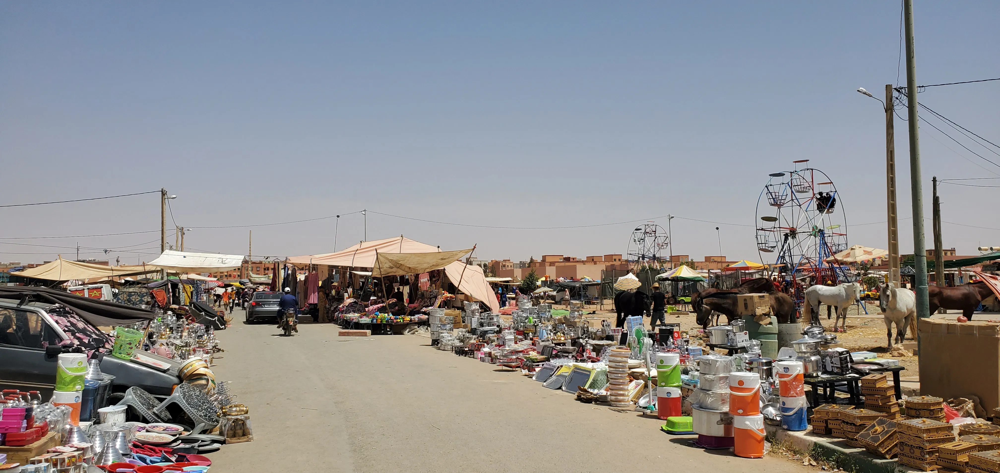
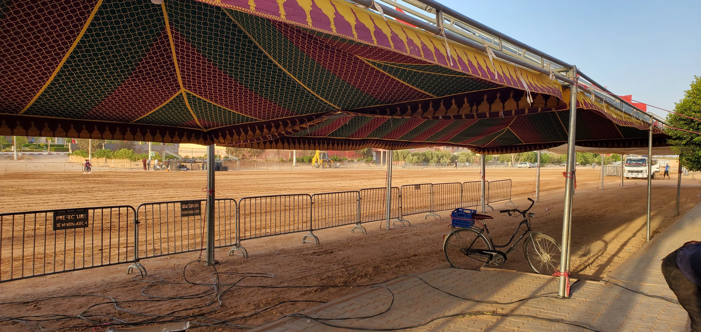
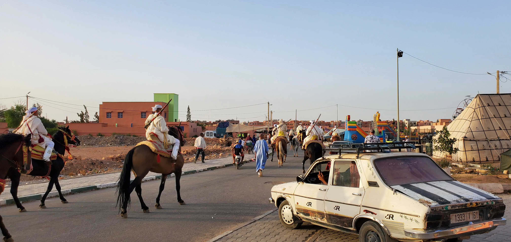

Last week, there was a _moussem_ (موسم) in my town. This is the Arabic word for "season" but in Morocco it basically means festival. People come from all over to sell their wares, see family, and watch the festivities.

I heard there was going to be one from one of the kids who works at a food place I frequent. He told me when the _moussem_ was and roughly what to expect, most notably that it was going to be packed with people. Then one afternoon, sellers started to pour in, filling up over a half mile long stretch of road, from the outskirts to the center of town. Each one set up a makeshift sun cover out of sticks, rope, and whatever opaque material they could find. They set out all of their stuff for sale on tables and rugs on the ground; jewelry, trinkets, home products, dishes, food, etc.

It was right down the street from my house and I could hear one of the seller's megaphones going all day, belting out prices for dates, nuts, and other foodstuffs. At night when people came out, it was a cacophony of people spitting out numbers, naming their prices with the Moroccan women challenging them in negotiation. The sellers clearly had done this before as they were perfectly comfortable dealing with four or five buyers at a time while also making change and answering questions from others.

Among the festivities that happened when it was cooler outside were ferris wheels, merry-go-rounds, and bouncy houses. A nice man would stand at the base of the ferris wheel and get his shoulder workout in by manually spinning the wheel. The kids would go have the time of their lives while their mothers sat in plastic chairs out front, watching and gossiping amongst themselves.

The street full of sellers that drew out throngs of people wasn't even the main event of the five day festival. People really come to see the _tbourida_ (التبوريدة). _Tbourida_ is a traditional cultural event of showmanship and the name comes from _barud_ (بارود), the Arabic word for gunpowder.

Troupes of men on horses come in groups of anywhere from 15 to 25 members. Them and their horses are outfitted in traditional wear and each member carries a musket. They circle around the arena so the audience can get a good look at them before lining up at the start of the arena. Led by a special rider in the middle, the group then starts to gallop in unison for about 200 yards and fire one round from their muskets at the end. The difficulty of it is the whole troupe is trying to ride in perfect unison and fire their rifles at the same time such that only one booming shot is heard.[^1]

There is a big open area right in front of the youth center that I work at and the day before the _tbourida_ started, there were water trucks going up and down the area, giving the dry, packed dirt some much needed hydration. Other trucks were bringing in hundreds of barriers to form the outer edge of the arena and yet another group was setting up tents so people could watch without sweltering in the heat of the sun.

I went to the first day of the event because I knew there were going to be less people and I could get a good view. From my window, I could hear the _clip-clop_ of horse hooves on pavement and I followed the convoy to the arena. Both the riders and their horses were dressed in their best traditional garb, far different than the equestrian gear I have interacted with in my rural Central Oregonian hometown.[^2] As the horses walked, I could hear the light tinging from the little bells that were hanging from their breast collars. The saddle pads were thick, constructed from a stack of squares of some kind of salvaged cushy material. Instead of a simple loop for stirrups, these looked like hollowed-out square lanterns with a big area for the booted feet of the riders to rest on. Where I would normally see a horn to dally off of after roping a steer, there was just a big hump for riders to maintain their balance with. The bridles were much more extravagant than the simple leather bands that I am accustomed to. They featured tassels and blinders to keep the horse's focus attuned to the one direction they needed to go—forward.

There were now hordes of people sitting in plastic chairs with even more standing behind them under the tents that were empty just a day before. I found a decent enough spot to stand in the tent that faced the arena such that the troupes would be running right at us. The men in the tent seemed content sitting in claustrophobic positions in the center. Behind me and the rest of the men standing was a sizable gap that let people pass through. Also taking this route were people selling refreshments like coffee, tea, and bars of peanuts and almonds. As they passed through, they would yell out whatever they were offering like someone selling hot dogs at a baseball game.

The tents only held a percentage of the audience. There were even more people crowded along the street about 50 yards north of the arena. Groups of kids were climbing onto people's roofs to get a good aerial view. Residents in the neighboring apartment complex invited another small mass of people to watch from their third story roof as well.

Troupes entered from the left, stopped and faced the crowd momentarily, then continued their gait all the way around the arena passing by the rest of the audience in the tents. At the same time, there were groups primed to make their run down the arena. The announcer informed us of the troupe and where they were from before saying "_yallah, tfdl_" to let them know they were clear to make their run.

The troupes would start at a trot to get a rhythm going. Once all their horses were in sync (or as close as possible), they would move to a canter or a full gallop. As they approached the crowd, I could start to hear the leader yelling over the trample of hooves, guiding the rest of the troupe to ensure that they all fired at the same time. Once they were about 20 yards out from the end of the arena, they would lift their muskets and deliver an ear-shattering blast. If they were sufficiently in sync, the crowd would erupt in cheer. The troupe would stop at the same place they stopped on their entry and soak in the applause that came from the crowd. The announcer would either thank the troupe with a _shukran si Mohammed_ or _bsha u raha_ (to your health and comfort) and their run was over. They would exit the arena from the same place they entered. I encourage you to go to YouTube to watch some videos that show the actual runs as well as delve into the history of _tbourida_ much better than I can.

For five days, the cycle continued. I would wake up to the megaphone blaring out the same prices as the previous day, it would quiet down while everyone had lunch and took naps, everyone would come out to go shopping in the afternoon, and finally end the night by watching the _tbourida_. After the last night, all the sellers started packing up their wares and makeshift tents and the riders loaded up their horses and took off for the wherever their next event was. The arena got packed up and the ground underneath dried back out. The streets emptied and my town fell back into its normal quiet and lazy state to finish out the rest of summer.

[^1]: This event has been [inscribed into the UNESCO Representative List](https://ich.unesco.org/en/RL/tbourida-01483) of the Intangible Cultural Heritage of Humanity. It describes the event and there are some gorgeous pictures there as well.

[^2]: Here is my crash course in horse gear anatomy for my urbanite friends. The breast collar is the piece that runs across the "chest" of the horse and connects to the saddle on the sides. Stirrups are the U-shaped things that hang to the sides of the horse for riders to put their feet in. The horn (present on a Western saddle) is the piece that sticks up between the legs of the rider. After roping something, the rider quickly wraps their rope around the horn to cinch it tight so that whatever is on the other end can be pulled. The bridle is the piece that goes over the head of the horse that allows the rider to control the horse. The bit is the metal piece that goes in the back of the horses mouth, over its gums. The reins connect to the sides of the bit and the bridle keeps the bit from coming out of the mouth. Blinders attach to the bridle and keep pieces of leather near the horse's eyes to block their vision such that they don't get distracted by things happening to the sides or behind them.
