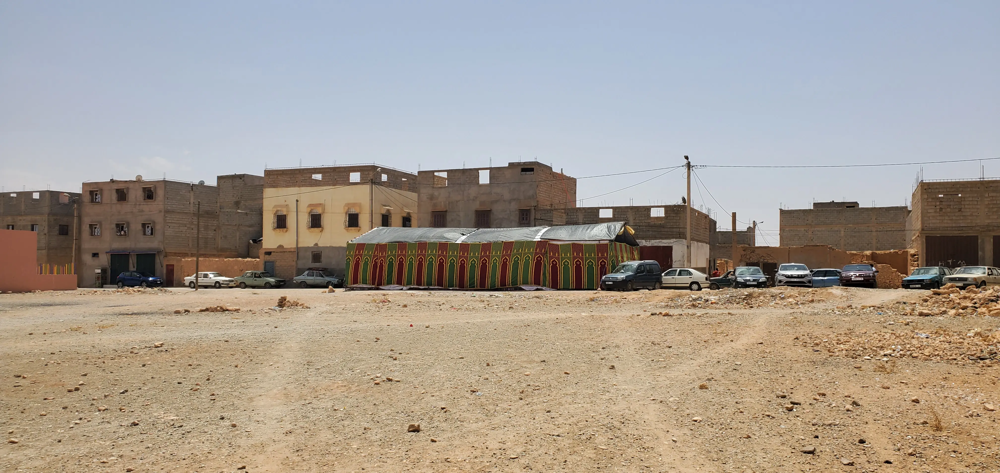
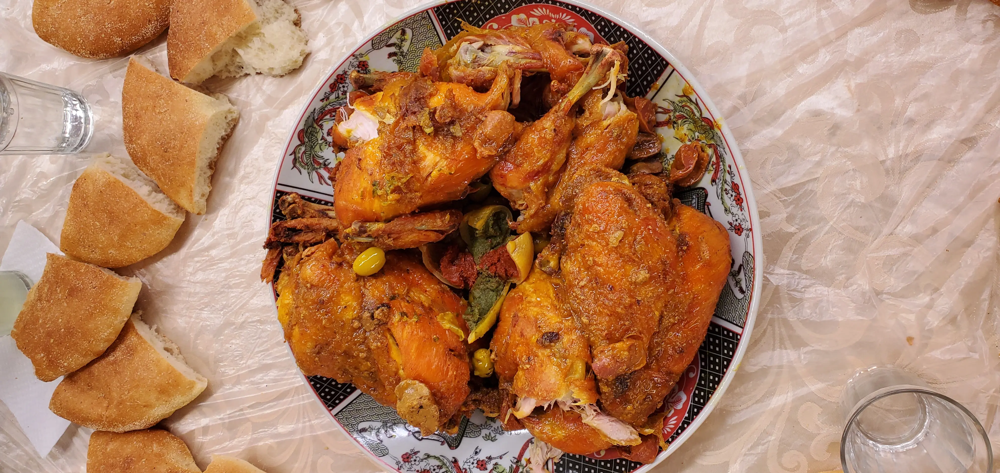
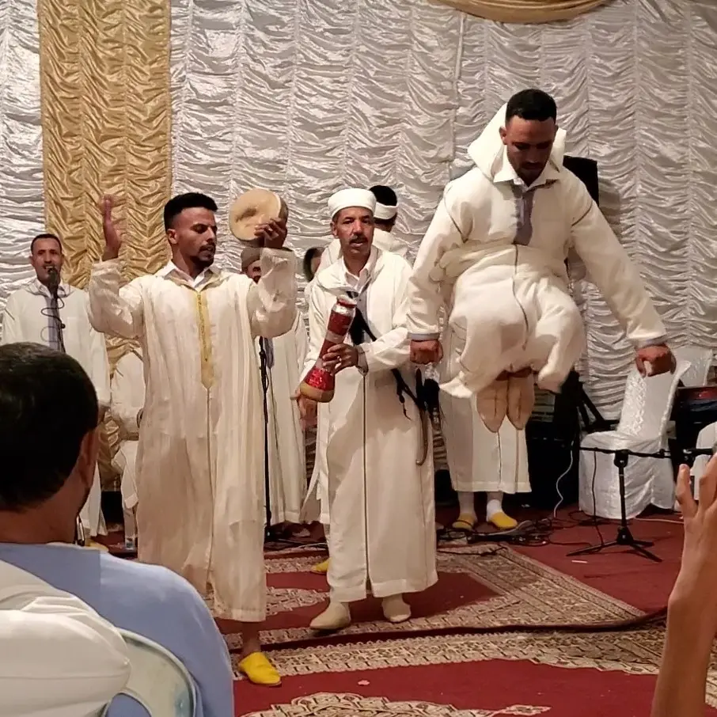
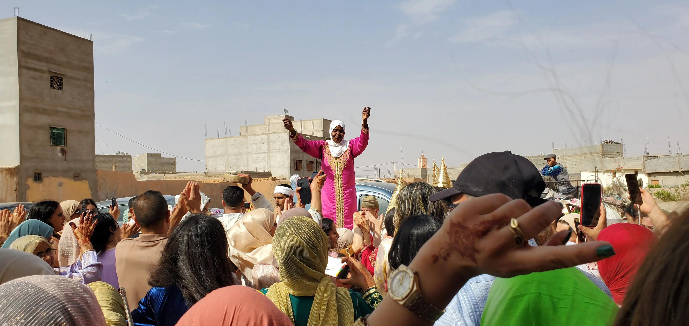

This is a very special two-part post! I went to my first Moroccan wedding and a few weeks later another volunteer in a different region, Ally, went to one. She was telling me about it and I mentioned that I was preparing this piece for my blog and asked if she wanted to write something. Fortunately for us, she said yes!

## Westley

I got invited to my first real Moroccan wedding. The bride is the neighbor of my host family here in my final site. At Moroccan weddings, everyone gets invited, neighbors and their weird American son included.

Also of note, Moroccan weddings aren't just one evening like American ones. They last all weekend.

The first function I was invited to was lunch the day before the wedding proper. I put on my red and gold _fuqaya_[^1] and went to my host family's home. As I turned the corner, there were about twenty cars parked all over and a giant tent (_khozana_) put up smack dab in the middle of the street.

My host sisters and some of their friends were doing [henna](https://en.wikipedia.org/wiki/Henna#Traditions_of_henna_as_body_art) on their hands and feet. My host dad, Shafei, had me follow him to the tent where lunch was going to be served. At the entrance was a jovial man on either side, prompting me to wash my hands. They poured water from a kettle and a perforated container underneath caught the water as it ran down my hands. The lunch was men only and every table in the tent was full. We squeezed in with some friends of Shafei's.

Inside the tent was beautiful. Dark red rugs lined the floor and the walls were covered with pleated white and gold fabric. Everyone talked quietly amongst themselves as the hosts passed around cups of tea and plates of nuts, dates, and sweets. In one corner were two or three tables of older men reciting verses from the Quran, as is usual for these kinds of gatherings.

Back in training, I went to a funeral gathering with a similar setting. It was a big tent full of men with a few tables of older men reciting the Quran. I asked my host brother why it sounded like singing rather than a monotone recitation that I would have expected. He explained to me and my fellow trainee, Christy, that it is recited how the prophet Muhammed heard it from the angel Gabriel. When I heard the small group of men reciting in unison, I felt a sense of awe, the same that I felt now sitting in this tent.

After the recitation and appetizer, the hosts passed out sheets of plastic to protect the white tablecloths from the impending feast. On top of the plastic, each table got a big bowl of bread that everyone got out and pulled into rough quarters in preparation.

The hosts started coming in and out with the first course. They plopped a plate of three roasted chickens, olives, and preserved lemons down in the middle of the table. Everyone dug in, first pulling off a small piece of bread then a small piece of chicken and soaking up some of the sauce that collected on the plate.

As much as I wanted to, I didn't fill up my stomach completely. At big Moroccan gatherings, there are usually two or three dishes brought out and if you fill up on the first, you can't enjoy the others. This time, the hosts swept away the plate with nothing but bones left on it. In its place, they put down a plate of roasted lamb and plums. This is one of my favorite Moroccan dishes. The lamb and sauce is so rich and fatty while the plums are sweet and sticky.

The last and final part of the meal was a big platter of fruit that replaced the last course on our table. It was a pile of watermelon and cantaloupe wedges, as that is what is currently in season. Conversations wrapped up at the table as everyone had a few slices and got up to leave. The same men who washed our hands when we came in were doing the same as we made our exit.

---

Just after lunch and just before everyone went home to take naps, I was invited to another function that same night. My host family told me there was going to be a "show" in the same tent that we had lunch in and I was told to meet them at ten that night.

After a nap and some errands in town, I made my way to my host family's a little before ten. Nothing was going on and most everyone was dispersed throughout the house asleep, aside from Shafei. We sat and watched the news on TV with my host dad translating some things every so often from the Arabic they spoke to the regional Arabic that I am learning. This lasted for a while and I was starting to think the "show" got cancelled and no one told me. Just as I was about to go home and go to bed, at _one in the morning_, my host mother and two of my host sisters got ready and we went to the tent.

Inside was the same setting that I found at lunch earlier that day with the tables removed and a group of men wearing white jellabas[^1] and holding various sized drums. We split off with the men sitting in the front few rows and the women filling the back.

After testing all of their equipment and getting ready, they started beating their drums and dancing. The oldest man in the group was sitting in the center with two steel rods drumming on an old brake cylinder with one side propped up on a flip-flop. It rung out with quick successive _ting-ting_'s that created the central rhythm.

The singer belted into the microphone some lyrics that I didn't understand and the rest of the group repeated exactly what he sang. Every once in a while, there would be times with no drumming and just a booming voice. Then, one by one, the drummers would come in to create the same familiar rhythm.

During some of these pauses, a man would come to the front and start stomping his feet and jumping up and down enthusiastically. Next to him, another member would watch intently and hit his drum at the same time that the first man's feet would make contact with the ground.

There was also a big green cylinder like a short and wide oil drum flipped over so that someone could stand on top of it. The same jumping man wore special shoes with a harder bottom on them got on top of the make-shift drum and stomped his feet making a deep sound I could feel in my chest. At one point, an audience member got on the foot drum and did the same foot stomping while also twisting his body and raising his arms, making a show of it. Everyone cheered him on and he had a big smile on his face going back to his chair.

People came up every so often to stick money in each of the dancer's hats or shirts to show appreciation and to pay them. One stuck a 50 dirham note to the bald singer's sweat glistened head.

I watched and clapped along until I couldn't stay awake anymore at around 3:30 in the morning. The next day my host sister, Hajar, told me they stayed out until almost six in the morning, dancing, singing, and celebrating.

---

I slept in late the next day. I had barely had breakfast before Hajar called me and told me to come over again.

Soon after I got to the wedding tent, people started filing out into the street clapping and singing. Down the road was a convoy of horse-drawn trailers, cars honking, the band from the previous night (with the brake cylinder guy drumming away, sitting contently on one of the trailers), and a whole group of people clapping excitedly. The two crowds merged into one and a member of the welcoming party was spritzing a scented liquid on everyone, customary protocol for these sorts of things. The trailers and cars brought various gifts for the bride like clothes, milk, incense, and sugar.

Everyone crowded around and sang with the drummers doing their thing. People took turns getting on one of the trailers to dance, elevated in the middle of the crowd.

Eventually, the crowds dispersed and Hajar told me to follow them into the tent. Like the previous day when the tent was full of men, this time it was all women. Besides the men handing out dates and water, there were exactly two other men in there; me and the DJ, Hakim. They got me a chair and I nestled in behind his booth, barely out of his way.

The bride and groom came in and took pictures in front of the gifts that were brought earlier. Everyone had their phone out, eager to take a picture of them. After a while of this, the bride and groom exited while Hakim played music and people talked at their tables and some younger women danced in the front. Hakim was explaining stuff to me and giving me a whole page of new Arabic words.

The bride came back in a little while later after doing an outfit change. She was wearing white and gold with a tiara on her head. She came in and sat on a silver pedestal (called an _amariya_) as everyone took pictures again. Four men wearing gold and white with beige hats came and hoisted her and the pedestal up onto their shoulders. They held hands and moved their feet in unison, ebbing back and forth as the bride smiled and waved at the guests below. Everyone took pictures as they moved about.

Eventually, they put the bride down and she left for, presumably, another outfit change as they disassembled the _amariya_. The music continued, only stopping for the afternoon call to prayers.

They started to bring in bread for each table, signaling that it was meal time. I was feeling particularly out of place in a tent full of Moroccan women and I was pretty burnt out so I called it a day there. I said thank you to Hakim, waved to Hajar, and shook hands with anyone that I passed on the way out.

This October, my host brother Youssef will be getting married _inshallah_ and I am so excited to go to another wedding and be more involved this time. It is such an honor to see and be a part of these life celebrations with my new friends halfway across the world.

[^1]: Traditional Moroccan clothing, like a [jellaba](https://en.wikipedia.org/wiki/Djellaba) but without a hood.

## Ally

Something that I think might be a universal truth for Peace Corps Morocco volunteers is that you never know what is going on. No matter how hard you try, no matter how long you spend in-country, you’re just not going to know what’s happening. You’ll never show up at the right time, you don’t know what to wear or what to say. All you can do is try your best. I find this is especially true for weddings.

I was lucky enough to be invited to a wedding by a couple of friends, Khadija and Chaymae. The wedding was an Amazigh wedding (also called _l3rs lShluw7_). Just to give you a little background, Amazigh peoples are the ethnic groups indigenous to North Africa who predate the arrival of Arabs to the region. I am located in the Middle Atlas region of Morocco where the Amazigh culture and language, called Tamazight, thrive.

So back to the invitation — a couple of weeks ago, my friends invited me to a family wedding that would take place in a nearby town. I excitedly accepted their invitation with a small stipulation. The Peace Corps has a rule that volunteers are not allowed to travel between cities after dark. I told them that I would absolutely love to attend, but I would have to spend the night with them at the host’s house to be in compliance with the rule. They happily agreed to my stipulation and actually preferred that I was sleeping over. It’s not uncommon for invites to dinner or bigger invites like weddings to turn into a last-minute slumber party.

The day of the wedding, Khadija and I made plans to meet and head to the host’s house sometime that afternoon. No time is given. We just say afternoon, so I am on standby that morning until I receive Khadija’s text that we will leave at 3pm. Okay great! I gather up my stuff and start making my way to the taxi stand at 2:50. I imagine they’ll be late, but I’d prefer to wait on them than have them wait on me. I sit for a few minutes then get a call from Khadija asking where I am. I tell her and she says she’s on her way to come get me. Okaaaay? She arrives and says, “We have to head to the salon, I haven’t gotten my hair done yet.” Deep breath, internal sigh, okay. We get to the salon and her little sister and cousin are there, also having their hair done. Several hair-dos and a set of nails later, we head out… to go rent Khadija’s outfit for the evening. This is just an example of how you never really know what’s going on. But you’ve just got to embrace it and go with the flow. Not to mention, a lot of the time, the unexpected changes to plan end up being a lot of fun!

We go upstairs to this cool shop that is obviously entirely dedicated to weddings. They have traditional Moroccan dresses, accessories, and jewelry to rent. There is a small salon to make-up the bride. On the other side is a small kitchen to prepare tea for the big wedding parties that get ready here. There are several women in the shop, chatting and working. There is a word for this in Darija that I love. It’s كايجمعو (_kayjm3u_), and it literally means “they are gathering”. It’s a word for sitting and spending time together. Talking, laughing, drinking tea. The energy of the shop is lovely, and they are kind to me. So of course I get totally carried away and end up renting some pretty glitzy, somewhat gaudy jewelry. (A black-beaded choker with a large diamond in the center and the dangly earrings to match, thank you very much. Moroccan traditional clothes meet goth vampires.) Who cares? It was a lot of fun and even more fun to dress up with them in my formal kaftan at the actual wedding. After we pay for the rentals, we head over to the taxi stand to go to the host’s house for the night!

In Morocco, there are two ways to greet people when you arrive at an event, and it depends on the size of the group. For a large event, with several rooms full of people, all you have to do is wave your right hand over the room to your heart and say _Salamu 3laykum_ to each room. If it is a smaller gathering, and you want to be liked, you go up to each person and give them a kiss on each cheek (in this region, it usually goes one kiss on the left, two on the right) and have a script ready. _“Salamu 3laykum, labas, tahenna, bkheir”_…. Basically means “Hi, how are you?”. It’s somewhat of an art to me because it’s really hard to kiss people and talk at the same time.

We get there early in the evening since it’s a family event for my friends. Which means that social obligation calls for an individual greet of everyone already there. I am a little weary of this since I tend to get pretty sick after these events where I kiss a lot of people. But again, I tell myself, “who cares?” — when in Rome, do as the Romans do. And maybe build a Roman immune system while you’re at it.

The house is stifling hot inside since it’s the last day of July. Even as the evening progressed, the house never cooled off. We sat outside in the street. The older women sitting on blankets and the younger women on bricks leaned against the houses. Eventually the women just decide to bring all of the furniture outside. This was great as other guests started arriving around 10pm or so.

One of the best things about Morocco is that you spend so much time at these events, that it’s not uncommon for people to just lay down and nap during the down time. I am one of those people. I used to be shy about it, but I got over that when I realized how quickly my social battery would drain otherwise. You want to lay down? Those ladies will bring you out a pillow, no questions asked. Embrace the Moroccan disco nap.

Around 8:30, Khadija tells me it’s time for an outfit change. We are going to wash our faces, change, and put on a little make-up. There is one spigot of running water, but there is an unspoken rule that the spigot is not for guest use. It’s reserved to the women cooking the food in the front room of the host’s house. So we use kettles of water. Khadija pours water into my hands so I can wash my face, then I do the same for her. On our way out, I am stopped by a woman who starts speaking to me in Tamazight. I know a few words and phrases, but it’s almost like a party trick. I am not able to communicate; however, I understand she’s asking me something about speaking Tamazight. I do know how to say “I don’t know”  in Tamazight, so I say that to her. She smiles and laughs a bit, so do the women around us who overheard the interaction. 10 months ago, this type of interaction would have me red with embarrassment. I know better now. These kind women were welcoming me and sharing their culture with me.

Everyone starts changing, and keeps telling me to do the same. But I’m already wearing my first outfit. When I asked her what to pack, Khadija told me I could wear my one dress to start the evening, so that’s all I packed. Everyone keeps looking at me and asking, “why aren’t you changing?” I just respond with “_Ma3ndish_” and a point to the woman’s outfit next to me. This literally means “I don’t have”. Khadija pulls out a royal blue velvet kaftan that she plans to wear to the next night’s festivities, but offers it to me since I won’t be attending part two of the wedding. I take one look at it and blanch. It is a very heavy, thick velvet blue kaftan.

We’re in a back room where we deposited our bags earlier, and I kid you not, it feels like a freaking sauna. After about 60 seconds of standing still back there, I became completely drenched in sweat. Like the very obvious, “ArE yoU oKAy??” kind of sweat. I tell her that while her kaftan is very beautiful, I am just too hot to wear it. But she insists I just put it on then take it off after a bit. I am so overwhelmed by her generosity, and by the compulsion to fit in, that I put it on.

At this point, I’m feeling pretty sick from the heat. While I feel death approaching, the other women start applying their makeup. I dread the thought. It’s just too hot, but I can’t go the rest of the evening without any makeup on. In Morocco, it’s almost rude to show up at these events without makeup on. I learned that the hard way when I came to a wedding in my everyday, natural makeup.

I look Khadija dead in the eye and say in the best Darija I can manage, “I cannot put on makeup here.” It’s not just because I feel ill, but my face is literally too wet to apply any makeup. So we head up to the roof with a shard of mirror and a phone flashlight. We spend about 30 minutes doing each other's makeup while in a Moroccan squat because you can’t sit down and dirty up your new outfit. We finish up and head back downstairs, and I catch a glimpse of all the other women in their new outfits doing the final touches on their makeup too. I absolutely love witnessing moments like this. It reminds me how special and fun womanhood can be.[^2]

I need to mention that the dress code for weddings in Morocco does not change like it does for weddings in the U.S.. Moroccan women know exactly what they’re supposed to wear and when because it’s the same for every wedding. I bought a deep red, beaded kaftan pretty early on in my service knowing I could wear it to any and every wedding I might be invited to.

After the rooftop makeup, we head outside. People have started pouring in, and the wedding has officially begun. We start to hear a car repeatedly honking from a few blocks away to signal the arrival of the bride. Everyone stands up and pushes forward to greet the car delivering the bride, and the male family members break out the drums. LET THE DANCING BEGIN! Specifically, we start doing _Ahidus_ (pronounced Ah - hee - duce). It’s a style of dancing in which the participants stand shoulder-to-shoulder, bouncing their shoulders and arms up and down, while shifting weight from foot-to-foot. It makes a bouncing, swaying line of people. Very fun to do and very cool to watch.

While people are dancing and singing, the bride stays in the car. Her face is covered by a stunning, glittery, semi-sheer veil called a _LaBrindig_. (Maybe called _laBrindis_, I did not fully hear my friend’s answer). Customarily, the bride does not participate in any of the singing or dancing. For most of the evening, the guests hardly see the bride. They take her into the house where people take turns going in to sit with her and take pictures with her while the rest of us stay outside to continue the celebrations.

I went inside with my friends to take pictures with the bride, and it struck me how young she was. In the region where I live, it is still common for women to get married pretty young. This bride is sixteen-years-old. I’ll save my opinions on that because I have many friends in my site that got married that young or intend to get married young. I will tell you that seeing her didn’t exactly make me feel like celebrating.

I can also tell you that this is the part of the evening where I started to get crabby. I’m looking back through my notes, and it’s apparent that I was annoyed. (Side note: I was just hangry and immediately felt better after dinner.)

The real dancing began around 1am after we finished up dinner. The Nai player showed up and showed out. A nai is a reed flute and a traditional instrument played at Moroccan weddings. And it is the coolest thing ever. This man absolutely lit up the party along with the drummers. Everyone went wild! The young women wrapped their _mzuns_ around their waists and got after it. (Pronounced moo-zoon; it’s a long rope with small silver disks on it that make noise when you shake). The women without _mzuns_ made an _ahidus_ line around the ones who did. We danced like this until about 3:30am.[^3] All of the neighborhood women were in attendance. All of the men stood off to the side in the dark watching the festivities. Neighbors and young kids watched from the roof. On one roof in particular, a young girl was dancing with her _mzun_ by herself, having the time of her life. We all were. I danced so hard with Khadija’s mom that when the song ended we collapsed into each other’s arms laughing.

Even though I was cranky and hot at points, it’s nights like these that remind me of home and how I could never truly explain an experience like this to my family. An all-night Amazigh wedding in the mountains of Morocco is an experience my family will likely never have, and that’s the reason I joined the Peace Corps. To meet people and be exposed to things I never could have otherwise, to grow and learn and be changed forever.

<iframe width="560" height="315" src="https://www.youtube-nocookie.com/embed/G-9YvJhf1Wo?si=HnS9aHd9sj2kJup6" title="YouTube video player" frameborder="0" allow="accelerometer; autoplay; clipboard-write; encrypted-media; gyroscope; picture-in-picture; web-share" referrerpolicy="strict-origin-when-cross-origin" allowfullscreen></iframe>

[^2]: There were two more outfit changes after dinner. (Dinner was served at 12:30am)

[^3]: Party ended around 4am. I slept on the roof along with 15 other guests. We had to sleep on the roof because of the Peace Corps’ policy about traveling after dark. Khadija and her family are so kind and accommodating to me about the rules I have to follow. I am beyond grateful for her understanding.
