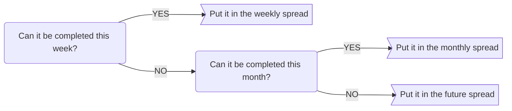
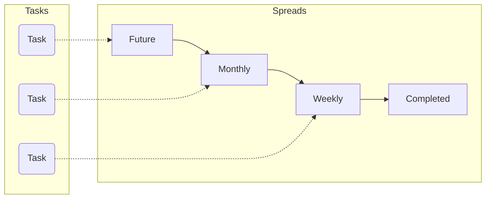
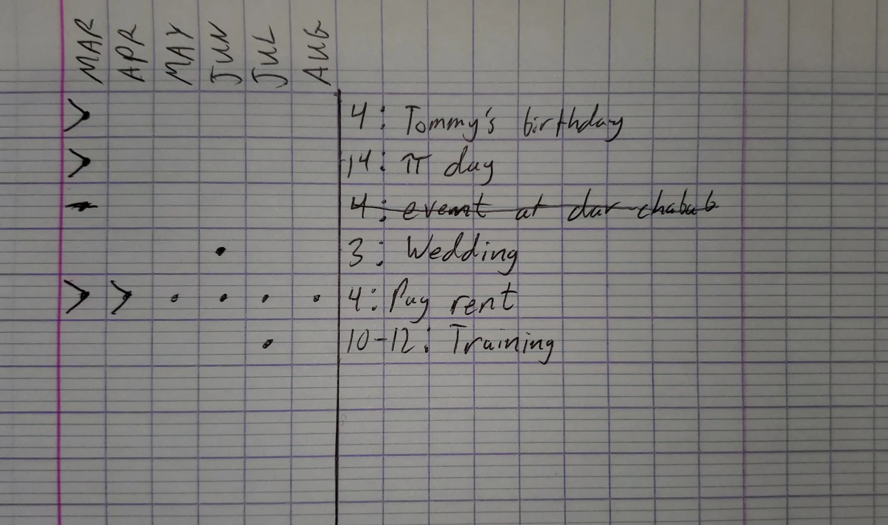
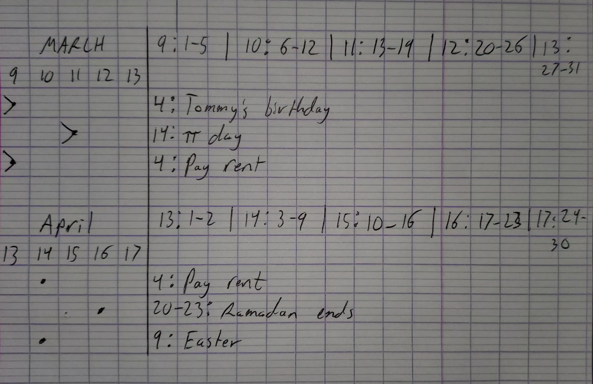
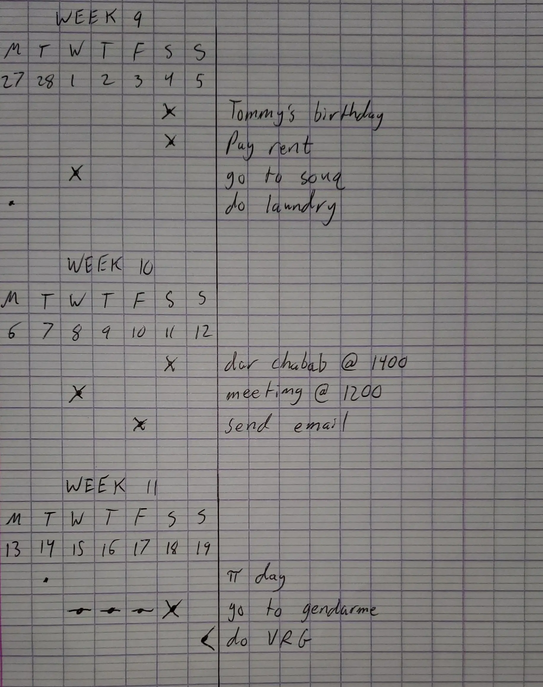

_How I setup and use a physical notebook for task management and to make sure nothing gets forgotten_

## Overview

This is my _personal_ workflow that I use for my task and date management. It is super boring (in a good way!). It means that it is no-nonsense, simple, sustainable, and reliable method for tracking things that you need to do. It works great for me but please adapt it to your own needs to create your own perfect system.

I combined two different frameworks to land on my system. I started with the [Bullet Journal method.](https://bulletjournal.com) It's dynamic, robust, and easy to get started with. While the method itself is flexible, it is physically rigid. The problem I had was wasted paper and wasted time. The BuJo method asks you to create a new page for each month and reserve a bunch of blank pages for your future spread. There was either way too much space on the pages which led to wasted paper or not nearly enough which led to frustration.

It was also so much work to keep updated. I constantly had to redraw these spreads, counting dots to get the perfect divisions and lines all over the place. This created too much friction for me and I never got into a habit of using my notebook. It also became a bit of an internet fad to have these elaborate drawings and a perfectly executed page for every so called "collection" in your life. It invited me to bloat my notebook with shiny new stuff I didn't need or use rather than stick to the essentials. I did, however, keep most of the symbols from the original BuJo system.

As for the second framework, I took a page out of the [GTD (Getting Things Done)](https://gettingthingsdone.com) book; contexts.

> [!info]  
> Contexts identify tools, places, or people that you require to complete a given task. In other words, contexts allow you to focus on what you can actually get completed given your current circumstances.  
> \- [Todoist](https://todoist.com/productivity-methods/getting-things-done)

The GTD method encourages you to tag different tasks based on context so that when you are in that context, you know exactly what you can be doing. You don't want to be filtering through `home` tasks when you are at work or filtering through `computer` tasks when you are offline. For me personally, time is way more important than physical contexts. I put dates on all my tasks and do them based on that rather than waiting to be in a specific context. Adding proper contexts to tasks adds too much work than value I get out of it.

In my system, my **context categories are months, weeks, and days of the week**. If you wanted to, you could also add more traditional contexts like `computer`, `cafe`, `dar chabab`, etc. but, again, that is more work for me that isn't particularly useful.

I put these two frameworks together and now I consistently use my notebook and can quickly get a glance at all of the tasks that I have and in what order I should do them in. More importantly, I never forget things that go in the notebook. It is a system that I trust and I can rest easy knowing everything I need to remember is all in the book.

## Concepts

1. Quick capture
2. Everything has a place
3. Flow
4. Minimize wasted paper

## Quick Capture

Another bit that I got from GTD is quick capture; always have a way to capture thoughts, ideas, and things you want to remember in the moment. I always have a pen and a little notebook in my pocket to write things down in. The important thing is regularly getting it out of the quick capture notebook and into my actual notebook or another system for long-term storage.

The majority of my quick capture notebook is Darija words but it can also contain people's birthdays as I hear about them, lesson plan ideas, events in the future, kind notes from others, etc. I also use [Google Keep](https://keep.google.com) to write little notes if using my notebook isn't convenient at the time for whatever reason.

You can also carry around a notebook that is both your main one and your quick capture one if that is convenient for you. I don't like lugging around my big notebook so I opt for a small pocket one and I transfer stuff at the end of each day.

## Everything Has a place

Basically, there is **a line in my notebook for every single important task or date in my life.** When I hear about a new task or date, I don't have to spend mental energy figuring out where to put it in my notebook and I trust my system to not let it slip through the cracks.

They are broken into progressively more refined time blocks (called spreads), starting at the high annual level and working down to the weekly level.

### Spreads

#### Future

The future spread looks six months into the future max. For the rare times I am planning out farther than that, I just write those on the margins of the future spread (utilizing that wasted paper space). The six months is customizable, I kind of chose it arbitrarily. It's a good mix of being far enough in the future and not wasting paper. **Each month is a context category.**

#### Monthly

Each month is split up into weeks. **Weeks of the year, not weeks of the month.** For example, it is March 31, 2023 right now and it is week 13 of the year. **Each week is a context category.** I also keep a key on the same line as the month so I can quickly know what week a particular date falls into without consulting a calendar every time.

#### Weekly

This is where the magic happens and the majority of tasks end their lifecycle. The week is titled the same as it is in the monthly, based on weeks of the year. **Each day of the week (and its corresponding number date) is a context category.**

#### Daily (Optional)

This will depend on your setup. I used to make little notes in here and maybe journal once in a while but I found way better tools to do both (quick capture notebook and other software) and don't really use the daily note anymore. The only thing I think I use it for is for a particular drawing that I want to capture.

### Adding a Task

At most, you have to ask yourself two questions to know where a task or date goes:

## Flow: Migrating Tasks

This is the heart of the system and what allows new tasks to move through their lifecycle. Tasks generally flow forward from Future to Monthly to Weekly to Completed. They don't necessarily always start in the Future spread either (I don't plan my life that far out). Tasks usually get created in the Monthly or Weekly spreads and flow forward accordingly. They almost always end their lifecycle in the Weekly spread unless I am really on top of it and complete a task weeks in advance (rarely).

Sometimes, tasks flow backwards. For example, it's the end of the week and I realize a task isn't a particular priority anymore. I may move it to the monthly spread to tackle in a later week this month.

### Updating a Spread

When you need to update a spread when the month or week changes, it is easy. You don't need to create a new page unless the current one is full. Simply skip a line on the current spread, write the new context categories, migrate tasks, and you are done.

- When I create a new weekly spread, I look at the monthly spread for tasks that fall into this week. I transfer them from the monthly to the weekly where they will (hopefully) finish their lifecycle this week.
- When I create a new monthly spread, I look at the future spread for tasks that fall into this month. I put them in their correct week number context categories.
- When I create a new future spread, I look in the margins of the previous future spread. I either move it to its correct month or if I _really_ planned something, put it in the margin of the new future spread.

### Symbols

I use various markers to indicate task status. These markers are directly copied from the original Bullet Journal method.

- A dot means that the task is still alive in that location. If you see a dot in a monthly spread, that means it could have been moved from the future spread but has not been migrated to a weekly spread.
- An X means that the task is done.
- A strikethrough means the task is cancelled.
- An arrow pointed to the right (>) means that the task has been migrated forward (from future to monthly or from monthly to weekly).
- An arrow pointed to the left (<) means that the task has been migrated back (from weekly to monthly or monthly to future).
- An exclamation point is reserved for really important tasks.

## Physical Layout

I personally like Moleskine with a dotted layout but anything works. The vertical component of the dotted or a grid layout is very helpful compared to standard lined paper.

Each page (future, monthly, or weekly) has a vertical line running down the entire page on the left side. The columns to the left of this line are for marking context categories while the tasks themselves go to the right of this line.

### Example

For demonstration, privacy, and simplicity reasons, I made a toned down version in a normal old notebook.

**Future**  

My future spreads usually contain birthdays and holidays because I don't plan actual tasks that far out. In this spread, you can see that I have migrated tasks from March and April to monthly spreads. I can now forget that they exist in my future spread.

I can get a quick glance of what is coming up in future months by looking for dots in that context category. For example, I know that I have a wedding to go to on June 3rd and I have to pay rent on June 4th. Similarly, I have a training from July 10th to July 12th.

You can also see that it is easy to add recurring tasks, like paying rent on the 4th every month by just adding dots in each context category.

**Monthly**  

In this monthly spread, you can see the tasks that were in the future spread like $\pi$ day and paying rent.

You can also see the key for converting from a calendar date to its corresponding week number. Week 9 contains March 1st through March 5th, week 10 contains March 6th through March 12th, etc. This way, I don't have to look at a calendar when someone tells me that Easter is on April 9th. I look at the key, see that the 9th falls into week 14 and I add it accordingly.

**Weekly**  

Like I said, this is where the magic happens. You'll notice tasks from the monthly and future spreads alongside new tasks. If a task comes into my periphery and it can be done in the current week, I add it directly to the weekly spread (see the above flowchart).

It's also easy to scan and see tasks that I have yet to do. For example, I scan the context columns for dots and I see that I didn't do laundry that I wanted to do on Monday the 27th.

It's also incredibly easy to switch days when dates change. Just cross out the dot and move it to the right. For example, I was supposed to see the gendarme on Wednesday the 15th but he kept cancelling on me for three days straight until I finally visited him.

As for the last VRG task, I realized that I don't have the energy for it this week and I still have time so it's not a priority anymore. I simply put a left arrow on it to indicate that I migrated it back to a previous spread and that's it.

## Adapting the System

This is a very simple and boring system that can easily be built on. What's important is having a system that is reliable that you will use consistently. Use these ideas how you like to make a system that works for you.

I have hinted at a few ideas already that may work for you. First, you could add a daily spread to add notes, journal, sketch, or whatever your heart desires. When I did this, I would simply use a line to write the date and add notes below that line using as much space as I needed for my thoughts. The next day, I would skip a line, write the new date, and add more notes.

Second, you could add more contexts. This would keep the date contexts front and center while adding more information. Draw another line on the _right_ side of the page with whatever context categories you need. For example, your context categories could be `dar chabab` and `home` or `internet` for tasks that you might need to do while you have cafe internet.

Doodle, put stickers, highlight stuff, make it pretty. As I said, build the system that works best for you.

So long and thanks for all the fish,

**Westley Winks**
